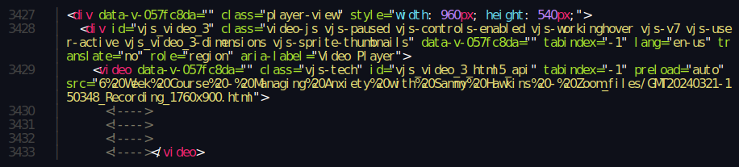

# How to download Zoom recordings

(or: the power of bookmarklets)

<!-- more -->

Sometimes you receive a link to a Zoom recording without the option to download it.
Sometimes it's not possible to watch it right away, or it's desirable to have a local backup
for later (possibly offline) watching, so what are the options?

Some people use a screen recorder or similar to capture the video content in realtime. But that's tedious and ugly. After all,
the video is streamed via network, so there should be some means to grab the raw data, right?

A dude on LinkedIn [posted instructions](https://www.linkedin.com/pulse/how-download-shared-zoom-recordings-pclaptops-nimish-agarwal/)
involving Chrome and a bunch of manual steps in the web developer console.
It boils down to extracting the `src` property of a `<video>` tag and manipulating the original website, adding a link pointing to the video resource.
Looked still a bit clumsy to me, there must be a better way ...

My first idea was to `curl` the recording URL and, via `xq`/`jq`, grab the video link from it.
But the stuff behind the recording's URL doesn't contain this data; it redirects the browser to another page
through some deferred-loading mechanism that I couldn't be bothered to figure out.

But what if we can let the browser do its thing and load the video page? And then use the browser to retrieve the video link for us?

This is the interesting piece of the website:

So what we need here is the contents of the `src` property of a element using the `vjs-tech` class.
With 3 lines of javascript in the browser console we can read the link and make the browser load it in a new tab:

The raw `.mp4` will open in a new tab and can be saved with the browser's "Save page as..." function.

But we can make it even more user friendly by wrapping the code in a one-line lambda function and make a 
[bookmarklet](https://www.freecodecamp.org/news/what-are-bookmarklets/) out of it. A bookmarklet is a piece
of JS code that is run over the currently loaded website when the bookmark is clicked.

Voilà, now we have extended our browser to allow us saving a Zoom video by just clicking on a bookmark.
